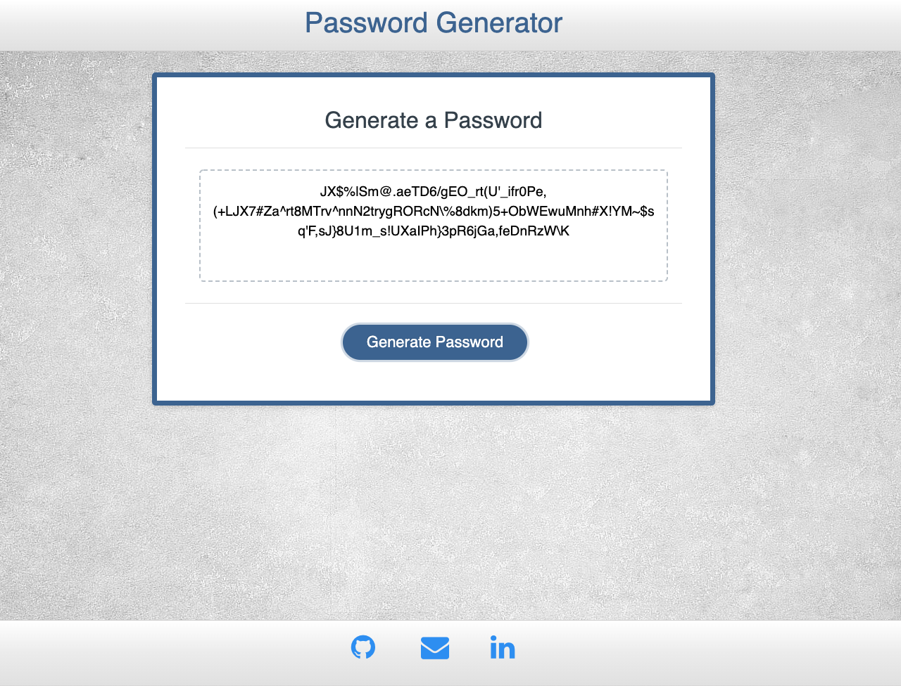

# Password-Generator

This password generator randomizes characters to help you create a secure password. I created this using javascript and predesigned html and css files which I updated and added styling and a new color-scheme through bootstrap. 

[Deployed link](https://gary-bergman.github.io/Password-Generator/)

[My github](https://github.com/Gary-Bergman)

